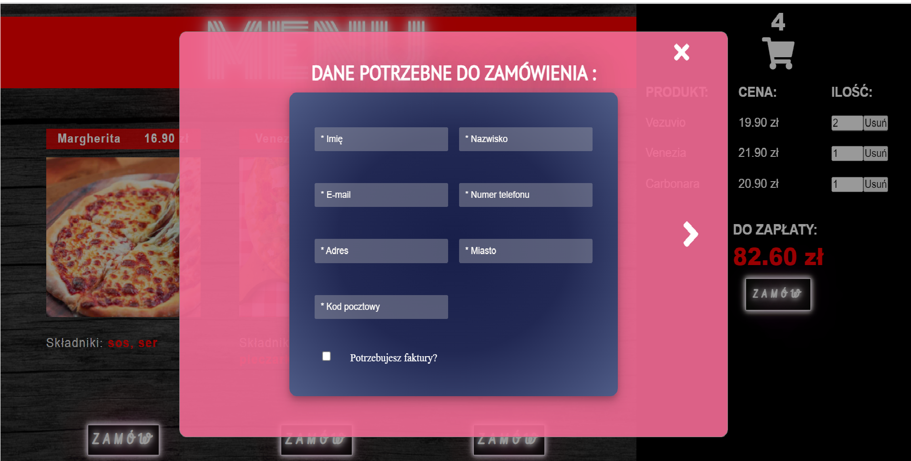
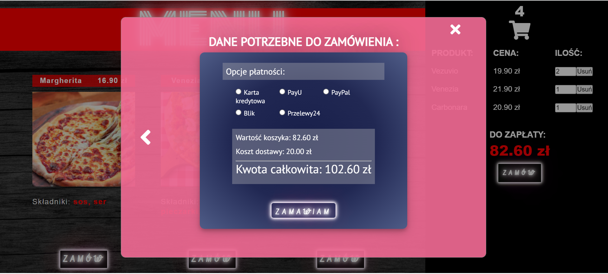
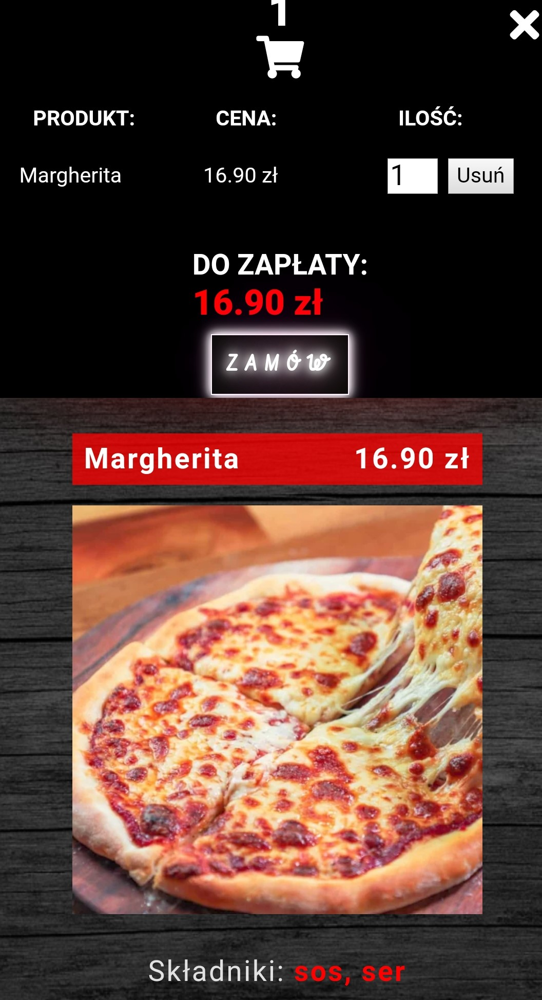
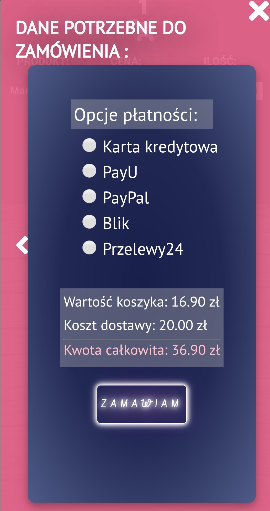

# Pizzeria

## General Information

- Pizzeria is an application which aims to add pizza to the cart after clicking on the button "Zamów"
- The pizzas’ list is dynamically loaded from https://raw.githubusercontent.com/alexsimkovich/patronage/main/api/data.json
- One pizza can be added a few times to the cart. 
- The application calculates the amount to be paid for a given order. 
- It counts also the total number of ordered products. 
- User can change the quantity of a given item in the basket by using the arrows or manually entering the number of a given pizza’s sort. 
- User can also reduce the quantity by using the remove button (Usuń). When there is one pizza of a given type in the basket, the remove button throws away this particular type of pizza from the cart. 
- The amount to be paid is updated on a regular basis - after each addition of a pizza to the basket, as well as after manual changing the number of products in the basket.
- After choosing products in basket, user is asked to fill the form with personal data for the purpose of accomplish the order. User can proceed to the next step after filling correctly all mandatory fields. When at least one of those fields is empty or incorrectly filled, an information 'Form incorrectly completed' appears. If all is correct, user can go to the next step. 
- In this part of application user is asked to choose a payment method. There is also a short summary of order: price of products in basket is summed with the delivery coast, which gives the final amount to be paid.

## Motivation and problems encountered

- The motivation for creating this application was the willingness to understand the concept of Fetch API. In this project I use the fetch method to download the list of pizzas, then I apply the displayPizzaSection function in order to create DOM elements to put the retrieved information inside them. 
- Another problem I have to deal with is adding a given pizza to the cart. For this purpose, I create the addToBasket function, which is called after clicking on the order button (Zamów). This function clones the name of the pizza and its price (for this purpose I used the cloneNode method), then adds both information in the basket with the quantity of the product and the delete button.
- Familiarizing with the forms

## Technologies Used

- Html - version 5
- Css - version 3
- JavaScript - version 1.7

## Screenshots

  Web version

 
 
 
 

  Mobile version
  

## Live demo

Click [_here_](https://youthful-babbage-ae077a.netlify.app/).

