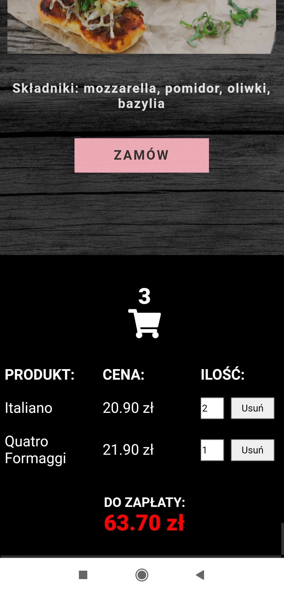

# Pizzeria

## General Information

- Pizzeria is an application which aims to add pizza to the cart after clicking on the button "Zamów"
- The pizzas’ list is dynamically loaded from https://raw.githubusercontent.com/alexsimkovich/patronage/main/api/data.json
- One pizza can be added a few times to the cart. 
- The application calculates the amount to be paid for a given order. 
- It counts also the total number of ordered products. 
- User can change the quantity of a given item in the basket by using the arrows or manually entering the number of a given pizza’s sort. 
- User can also reduce the quantity by using the remove button (Usuń). When there is one pizza of a given type in the basket, the remove button throws away this particular type of pizza from the cart. 
- The amount to be paid is updated on a regular basis - after each addition of a pizza to the basket, as well as after manual changing the number of products in the basket.

## Motivation and problems encountered

- The motivation for creating this application was the willingness to understand the concept of Fetch API. In this project I use the fetch method to download the list of pizzas, then I apply the displayPizzaSection function in order to create DOM elements to put the retrieved information inside them. 
- Another problem I have to deal with is adding a given pizza to the cart. For this purpose, I create the addToBasket function, which is called after clicking on the order button (Zamów). This function clones the name of the pizza and its price (for this purpose I used the cloneNode method), then adds both information in the basket with the quantity of the product and the delete button.

## Technologies Used

- Html - version 5
- Css - version 3
- JavaScript - version 1.7

## Screenshots

  Web version
  

  Mobile version
  

## Live demo

Click [_here_](https://youthful-babbage-ae077a.netlify.app/).

